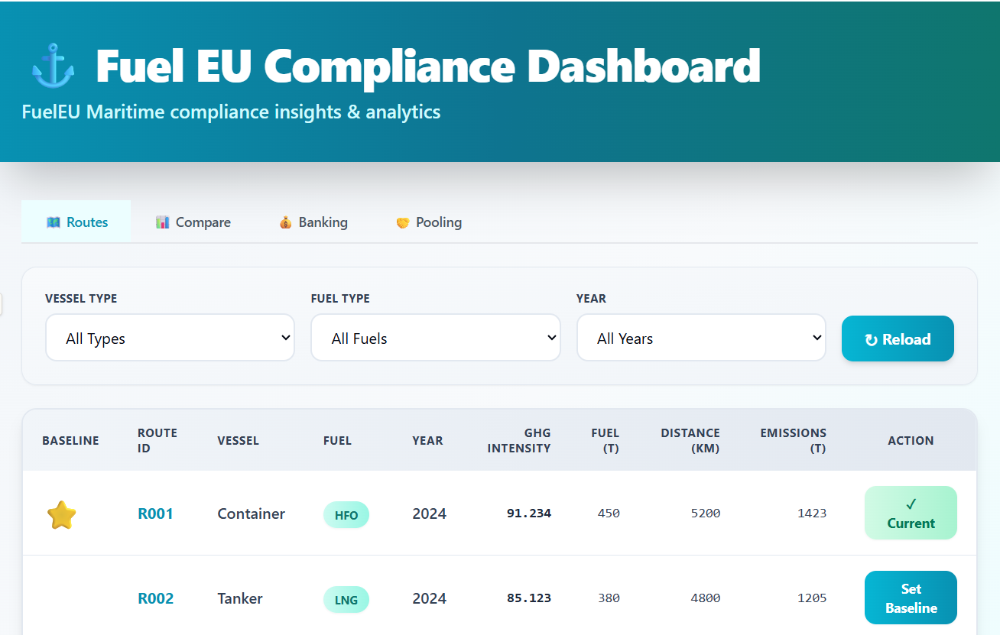
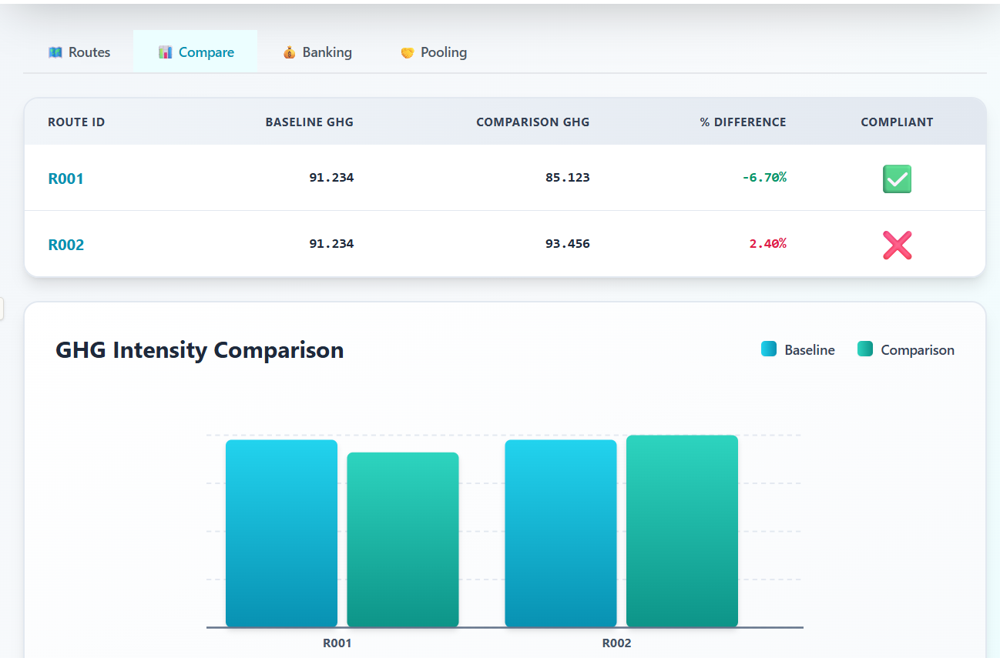

🚢💡 FuelEU Maritime Compliance Suite

Smart. Modular. Compliant.
A next-generation platform that transforms FuelEU Maritime compliance into a data-driven, interactive experience — powered by Clean Architecture principles and modern web technologies.

🧭 Tech Blueprint
Layer	Stack
🎨 Frontend	React · TypeScript · TailwindCSS · Vite
⚙️ Backend	Node.js · Express · PostgreSQL · TypeScript
🧱 Architecture	Hexagonal (Ports & Adapters / Clean Architecture)
🧪 Testing	Vitest (Unit & Integration)
📚 Docs	AGENT_WORKFLOW.md · REFLECTION.md
🌊 What It Does

FuelEU Maritime Compliance Suite brings together regulation data, vessel insights, and energy efficiency metrics into one powerful dashboard.
It enables you to:

🗺️ Map & analyze routes

📊 Compare compliance performance

💰 Bank or apply surpluses

🤝 Create compliance pools

💡 Visualize fuel efficiency impact

Designed with clarity, modularity, and domain-driven thinking at its core.

🗂️ Project Structure
backend/
 ├── core/                  → Domain entities & logic
 ├── application/           → Business rules (use-cases)
 ├── ports/                 → Interfaces for adapters
 ├── adapters/
 │   ├── inbound/http/      → Express controllers
 │   └── outbound/postgres/ → PostgreSQL repositories
 ├── infrastructure/
 │   ├── db/                → Migration & seed
 │   └── server/            → Composition root
 └── shared/                → Common constants/utilities

frontend/
 ├── core/                  → Pure domain types
 ├── adapters/
 │   ├── ui/                → Pages & components (inbound)
 │   └── infrastructure/    → API client (outbound)

🧩 Clean separation ensures testing, replacing, or extending layers is seamless.

⚙️ Backend Setup

Configure your environment:

cd backend
cp .env.example .env

Fill in your DATABASE_URL and PORT.

Install dependencies:

npm install

Run database migration and seed:

npm run migrate
npm run seed

Start backend:

npm run dev

→ Server runs at http://localhost:3001

💻 Frontend Setup

Install packages:

cd frontend
npm install

Start Vite dev server:

npm run dev

→ Dashboard runs at http://localhost:5173

⚡ The frontend automatically proxies all API requests to your backend.

🔗 Core API Endpoints
Method	Endpoint	Description
GET	/routes	Fetch all seeded routes
POST	/routes/:id/baseline	Set a baseline route
GET	/routes/comparison	Compare baseline with others
GET	/compliance/cb	Compute compliance balance
GET	/compliance/adjusted-cb	CB after applying banked records
GET	/banking/records	Retrieve banking ledger
POST	/banking/bank	Bank positive CB
POST	/banking/apply	Apply banked CB
POST	/pools	Create and validate a pool

🧮 Formula Used:
CB = (Target(89.3368) − Actual) × (FuelConsumption × 41,000 MJ/t)

🧪 Testing
cd backend
npm test

🧩 Includes:

ComputeCB

ComputeComparison

BankSurplus

ApplyBanked

CreatePool

Tests run in-memory, no external DB required.

🎨 Dashboard Highlights
🗺️ Routes

Explore all registered routes and set a baseline.

📊 Compare

Visually compare energy efficiency and compliance metrics.

🏦 Banking

Track compliance balance and manage surplus banking.

🤝 Pooling

Form compliance pools and validate group performance.

🧰 Developer Notes

✅ TypeScript strict mode enabled

🧹 ESLint + Prettier ready

🐘 PostgreSQL handled via pg

🧱 Decoupled, domain-driven, framework-agnostic design

🌟 Why It Stands Out

✨ Architected for change — Easily swap adapters, UI, or databases
⚡ Performance-focused — Vite + Tailwind = blazing fast frontend
🧠 Domain-first — Business logic independent of frameworks
🔍 Testable — Core logic runs without a database

🚀 Built for the Future of Maritime Compliance

Sail beyond regulations — with structure, precision, and innovation.

🛞 FuelEU Maritime Compliance Suite — where Clean Architecture meets the open sea.